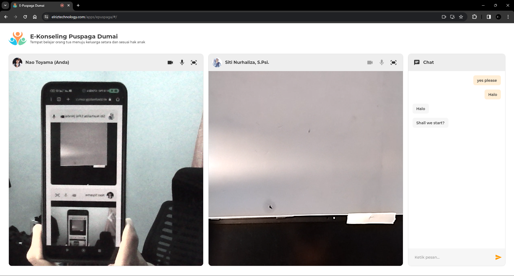
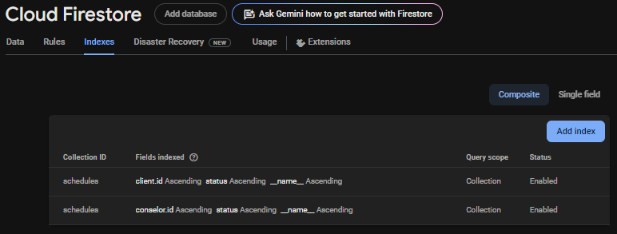

# e_puspaga

An online counseling service application facilitates connections between families and counselors through a scheduled counseling system, realtime chat and video call communication, utilizing Flutter WebRTC.




## Demo
[https://elriztechnology.com/apps/epuspaga](https://elriztechnology.com/apps/epuspaga)

#### Test Accounts:
| Level    | Test Accounts        | OTP Code   |
|----------|----------------------|------------|
| Client   | 62 333333333333      | 333333     |
| Counselor| 62 222222222222      | 222222     |
| Admin    | 62 111111111111      | 111111     |

## Features

- **User Management**: Create and manage accounts for staff and participants.
- **Service Scheduling**: Schedule and manage family learning sessions and services.
- **Reports**: Generate reports for attendance, participation, and service efficiency.


## Getting Started

### Prerequisites

- [Flutter](https://flutter.dev/docs/get-started/install)
- [Dart](https://dart.dev/get-dart)
- Firebase account for backend services

### Installation

1. **Clone the repository:**
    ```sh
    git clone https://github.com/elrizwiraswara/e_puspaga.git
    cd e_puspaga
    ```

2. **Install dependencies:**
    ```sh
    flutter pub get
    ```

3. **Set up Firebase:**
    - Create a new project on [Firebase](https://firebase.google.com/).
    - Follow the instructions to add Firebase to your Flutter app [here](https://firebase.google.com/docs/flutter/setup).
    - Enable phone authentication provider
    - Update cloud firestore rules to allow read write operation
    <br/>

    ```
    service cloud.firestore {
      match /databases/{database}/documents {
        match /{document=**} {
          allow write: if request.auth != null;
        }
        match /users/{document=**} {
          allow read;
        }
      }
    }
    ```
    - Add cloud firestore indexes to enable query
    <br/>
    
    <br/>
    <br/>
    
    - Update firebase storage rules to allow read write operation
    <br/>

    ```
    service firebase.storage {
      match /b/{bucket}/o {
        match /{allPaths=**} {
          allow read, write: if request.auth != null;
        }
      }
    }
    ```


4. **Run the application:**
    ```sh
    flutter run
    ```

## Contributing

Contributions are welcome! Please open an issue or submit a pull request for any bugs, feature requests, or improvements.

## License

This project is licensed under the MIT License - see the [LICENSE](LICENSE) file for details.

## Support

<a href="https://trakteer.id/elrizwiraswara/tip" target="_blank"></a>
